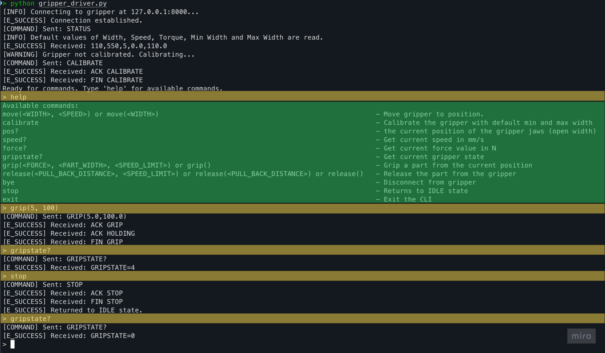

# Gripper Driver - Ashwin Murali
Program a driver for a two-finger gripper used in bin picking applications. Goal is to create a Python program that receives a width in millimeters and controls the gripper to maintain that distance between its two fingers. Program should also include any other features relevant for a driver. 

See [task overview](task.md) to know the details of this challenge.

# Getting-started
- Clone the repository.

- Install dependencies by running `pip install -r requirements.txt`.

- Run `pytest -v` to run unit tests.

- Run `python gripper_sim.py` in a terminal to simulates the mock gripper through a socket server.

- Run `python gripper_driver.py` to start a client CLI to communicate with the mock gripper. The communication is established through sockets as text-based interface. Type `help` in the CLI to know the list of commands and their purposes. Multiple clients can be started to communicate with the gripper simultaneously.

# Sample Outputs

## Example - MOVE, GRIP and RELEASE Commands
The following screenshot shows a sample usage of MOVE, GRIP and RELEASE commands through this work's gripper driver simulated against the mock gripper. 

## Sample Demo Video
See [video](docs/sample_demo.m4v) for a sample demo of using the driver's CLI to communicate with the gripper.

# Codebase

## Gripper Driver
This module is present in `gripper_driver.py` and provides a communication interface between the user and a mock gripper. It acts as a middle layer that enables seamless interaction by handling command transmission, response parsing, and maintaining the internal state of the gripper.
### Features
- **Text-Based Command Interface**: 
    - Supports commands defined using a Gripper Control Language (GCL) syntax ([Reference Manual](https://weiss-robotics.com/servo-electric/wsg-series/product/wsg/selectVariant/wsg-50-110/?file=files/downloads/wsg/wsg_gcl_reference_manual_en.pdf&cid=11209)).
    - Users send text-based instructions, which are internally parsed and validated.
- **Communication Recovery**: 
    - If the client becomes disconnected from the gripper (e.g., due to a cable disconnection), the driver automatically attempts to re-establish the connection and reloads the previously saved gripper state. This ensures continuity and minimizes disruption in case of temporary connection issues.
- **Command Parsing & Validation**: 
    - Uses regular expressions to match user commands against expected syntax patterns.
    - Validates commands for correct structure and presence of required parameters.
    - Performs type checking to ensure all parameters are correctly typed and within acceptable value ranges.
- **Reliable Gripper Communication**
    - Manages TCP/IP communication with the gripper through sockets. The static IP is currently set to `127.0.0.1` with port `8000`.
    - Handles both the transmission of commands and the reception of responses.
    - Ensures acknowledgment messages are received and interpreted accurately.
- **Feedback & Logging**
    - Displays info messages when commands are sent and acknowledgments are received.
    - Communicates errors, warnings, and status updates back to the user in real time.
- **State Management**
    - Maintains an internal representation of the gripper’s state to assist with decision-making and command sequencing.

## Mock Gripper Simulation
Since the actual hardware gripper is not available, a mock gripper has been implemented in `gripper_sim.py` to simulate the essential behavior of the real device. This mock gripper allows for testing and development without requiring physical hardware.

- The state "PART LOST" is a future work and out of scope for this implementation.

### Features
- **Command Execution**:
    - The mock gripper receives parsed and type-checked commands from the driver. It executes the actions specified in each command, mimicking the behavior of the real gripper.
- **State Management**:
    - The mock gripper maintains an internal state machine based on the official state diagram provided in the manufacturer's manual. All states are simulated except for the PART LOST state.
- **Client Communication**:
    - The gripper sends real-time status updates to all connected clients. Each command results in:
    - `ACK <COMMAND_NAME>`: Acknowledgement that the command has been received.
    - `FIN <COMMAND_NAME>`: Notification that the command has been successfully completed.
    - Error messages if a command fails or cannot be executed.

### Behavioral Assumptions
- **Move Command Simulation**:
    - The time taken to move is calculated based on the distance between the current and target finger widths as `time_to_move = abs(self.width - self.new_width / self.speed`.
    - The program sleeps for this duration to simulate movement time.
- **Grip Command and Part Detection**: When executing a `GRIP` command, the mock gripper checks whether a part is detected using the following condition:
    - When `width - grip_part_width >= 15` is True, it indicates that the part was not correctly gripped due to the width being too wide or too narrow, and a NO PART error is returned.
- **Release Command Timing**:
    - The time taken to release a part is calculated based on a simulated pull-back distance and speed limit as `time.sleep(self.pull_back_distance / (self.release_speed_limit / 100))`. 

## CLI Interface
- The CLI interface enables user to communicate with the gripper through the driver. The code is available in `interact.py`.

# Acknowledgments
- [Stack Overflow](https://stackoverflow.com/questions) - Helped resolve aand debug technical issues in the implementation.
- [ChatGPT](https://chatgpt.com/) – Assisted with refining README documentation and docstrings in code.
